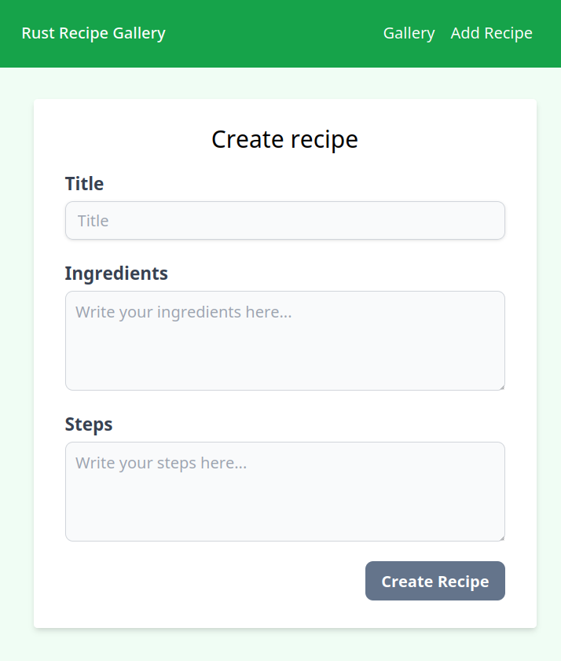

# GoRust Recipe Gallery
Learning Go and Rust by writing a full-stack application


## Opinions
See `go-backend/` for go build steps
### Rust Backend
- **Framework**: Auxm
    - It's really awesome
    - Really modular, with layers, state, logging, and more
    - The type system is really cool too
    - Docs are ok
    - Logging was kinda hard to setup and understand, but it's great once you get it working
- **Database Managment System**: Diesel
    - It's meh
    - I've found I had more issues than it had solved
    - Docs are not great
    - Probably should've used `sqlx` instead
- **Database**: Postgres
    - An array of non-null strings is not possible, bruh
    - It's cool though. I see why so many people use it

### Frontend
- **Framework**: Leptos
    - Very mixed feelings
    - I really like the philosophy of a fine-grained reactive framework
    - It takes 15 seconds to compile... Very bad dev experience
    - the `view!` macro is great, but doesn't have intellisense
    - also errors are wonky in the macro
    - SSR gets kinda complicated, espcially with the `cfg!` options and `Cargo.toml`. Also SSR bugs are quite hard to fix, but maybe this isn't solely a Leptos problem
    - Rust type system and borrow checker can get annoying with components
    - It's quite new, and somewhat buggy
    - `ErrorBoundary` is really wonky. Never worked for me
    - I actually didn't need a monorepo, and I could've just used server functions for the backend instead. No need for REST
    - Just use Svelte lol
- **CSS**: Tailwind CSS
    - I really like it, I see why everyone recommends it as well

## Setup

I recommend using the devcontainer to go directly to the build commands. Otherwise,\
Dependencies
- Docker
- Node
- Rust

Manually install dependencies:
```bash
cargo install diesel_cli cargo-leptos
npm install --global tailwindcss sass
# Optinal, for end2end tests
cd frontend/end2end/
npx playwright install-deps
npx playwright install
```
Build:
```bash
cd frontend/
cargo leptos serve --release

# Open a new terminal
docker-compose up --detach db # Only needed if not using devcontainer
cd backend/
diesel migration run
cargo run --release

# Optional, run tests (in a new terminal)
cd frontend/end2end/
npx playwright test
```

## Other commands to run
```bash
docker exec --interactive --tty --workdir /workspaces/rust-recipe-gallery rust-recipe-gallery-devcontainer bash

# run postgresql in the docker container
docker exec --interactive --tty rust-recipe-gallery-postgres bash
psql --username=postgres --dbname=recipe-gallery

# diesel commands
diesel migration run
diesel database reset

# Frontend
cd frontend/
tailwindcss --input ./input.css --output ./style/tailwind.css --watch
# new terminal
cargo leptos watch
# run client-side rendering only
trunk -v serve --features hydrate

# Backend
cd backend/
cargo run

# Frontend test
cd end2end
npm install
npx playwright test
# write tests
npx playwright codegen localhost:3000
npx playwright test --grep 'add recipe' --project chromium --trace on
npx playwright test --grep 'add recipe' --project chromium --headed
npx playwright show-trace test-results/tests-rust-recipe-gallery-add-recipe-chromium/trace.zip
/home/vscode/.cache/ms-playwright/chromium-1117/chrome-linux/chrome http://[::1]:9323
```

## SQL queries
```sql
SELECT * FROM recipes;
```
